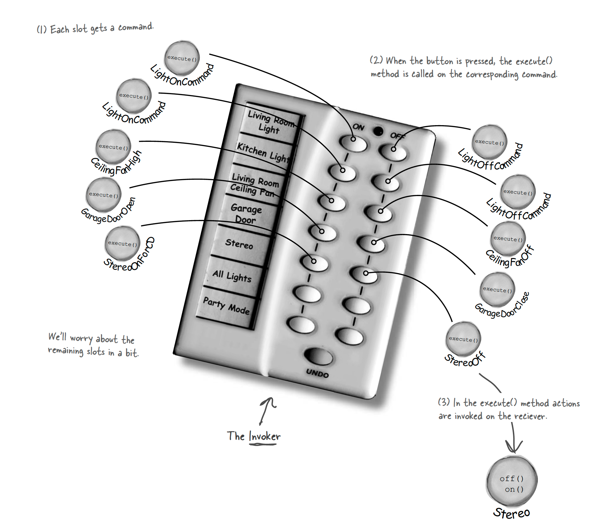

# Command Pattern

## Motivation
Design a remote control with 5 pairs of buttons(On and Off) to control the following home appliances
* kitchen light
* living room light
* ceil fan
* garage door
* stereo

## Problem
Each appliance has its own specific interface. Also, we might want to change functionality of each button in the future

## Goal
Separate Invoker( remote control) and action receiver( home appliances )

## Solution
encapsulates a command to home appliance in a command object and bind the command object with buttons on the remote control


### Command object
```Java
public interface Command {
    public void execute();
}

public class LightOnCommand implements Command {
    Light light;
    public LightOnCommand(Light light) {
        this.light = light;
    }
    public void execute() {
        light.on();
    }
}
```
### Remote Control(Invoker)
```Java
public class RemoteControl {
    Command[] onCommands;
    Command[] offCommands;
    public RemoteControl() {
        onCommands = new Command[5];
        offCommands = new Command57];
    Command noCommand = new NoCommand();
    for (int i = 0; i < 7; i++) {
        onCommands[i] = noCommand;
        offCommands[i] = noCommand;
    }
    }
    public void setCommand(int slot, Command onCommand, Command offCommand) {
        onCommands[slot] = onCommand;
        offCommands[slot] = offCommand;
    }
    public void onButtonWasPushed(int slot) {
        onCommands[slot].execute();
    }
    public void offButtonWasPushed(int slot) {
        offCommands[slot].execute();
    }
```
### Client
```Java
public class RemoteLoader {
    public static void main(String[] args) {
        RemoteControl remoteControl = new RemoteControl();
        LightOnCommand livingRoomLightOn = new LightOnCommand(livingRoomLight);
        LightOffCommand livingRoomLightOff = new LightOffCommand(livingRoomLight);
        remoteControl.setCommand(0, livingRoomLightOn, livingRoomLightOff);
        remoteControl.onButtonWasPushed(0);
    }
}
```
## Undo Operation
We can easily implement undo feature by modifying Command interface and keep track of most recent commands in remote control in a stack. Once pushing undo button, pop one comand and call undo() upon it.
```Java
public interface Command {
    public void execute();
    poblic void undo();
}

```

## Defination
The Command Pattern encapsulates a request as an object, thereby letting you parameterize other objects with different requests, queue or log requests(see below), and support
undoable operations.

## Other Use cases
1. Queuing requests: add commands to the queue on one end, and on the other end sit a group of threads. Threads remove a command from the queue, call its execute() method,wait for the call to finish, then discard the command object and retrieve a new one
2. Logging requests: save all the operations(commands) since the last check point, and if there is a system failure, apply those operations to the checkpoint. e.g. a spreadsheet application: implement failure recovery by logging the actions every time a change occurs. 
3. sets of operations in a transactional manner: all of the operations complete, or none of them do


