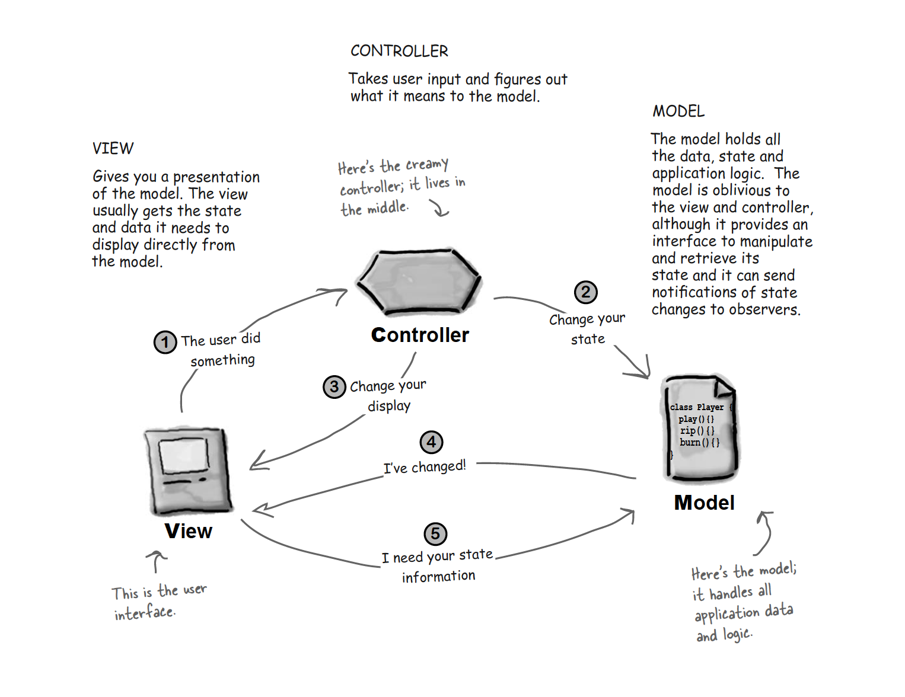
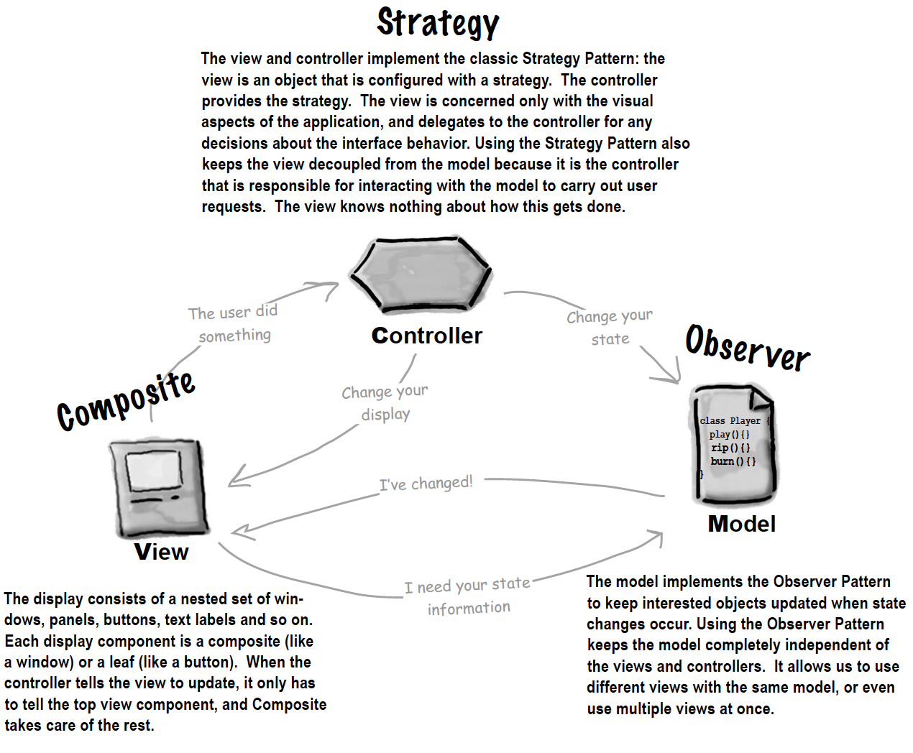
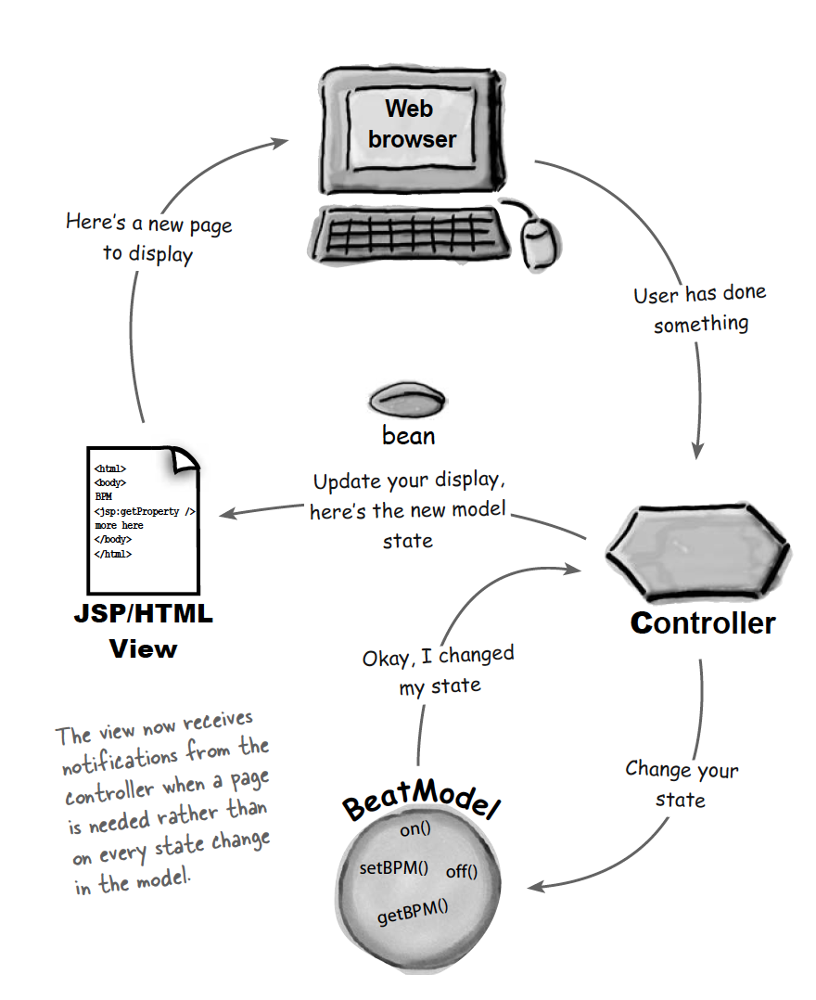

# Model-View-Controller

## Goal
Model holds all data, view displays data and controller is a bridge between them. We want to decouple data storage, manipulation and data visualization. This way, model is oblivious to any views and we can have views of different formats that use the same model

## Relationships among MVC

## Design Patterns in MVC

The Model View Controller Pattern (MVC) is a compound pattern consisting of the Observer, Strategy and Composite patterns.These patterns work together to decouple the three players in the MVC model, which keeps
designs clear and flexible.
- The model makes use of the Observer Pattern so that it can keep observers updated yet stay decoupled from them.
- The controller is the strategy for the view. The view can use different implementations of the controller to get different behavior.
- The view uses the Composite Pattern to implement the user interface, which usually consists of nested components like panels, frames and
buttons.

## Modification of MVC in Web applications
Note that in web application, views are not communicated with model directly. In another word, the view is no longer an observer of the model, it doesn’t register with the model to receive state change notifications. Instead, the view receive notifications from the controller when the model has been changed. 
