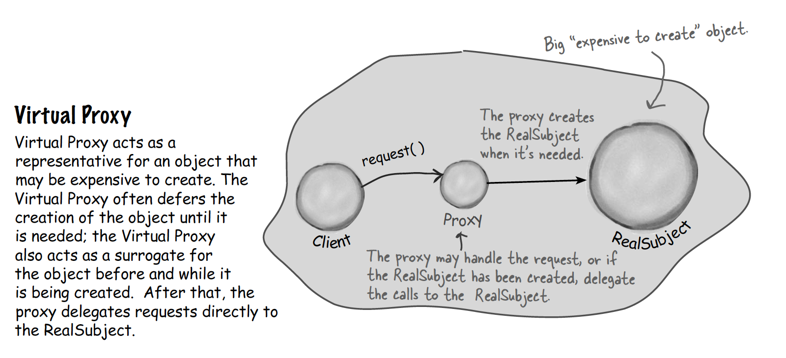
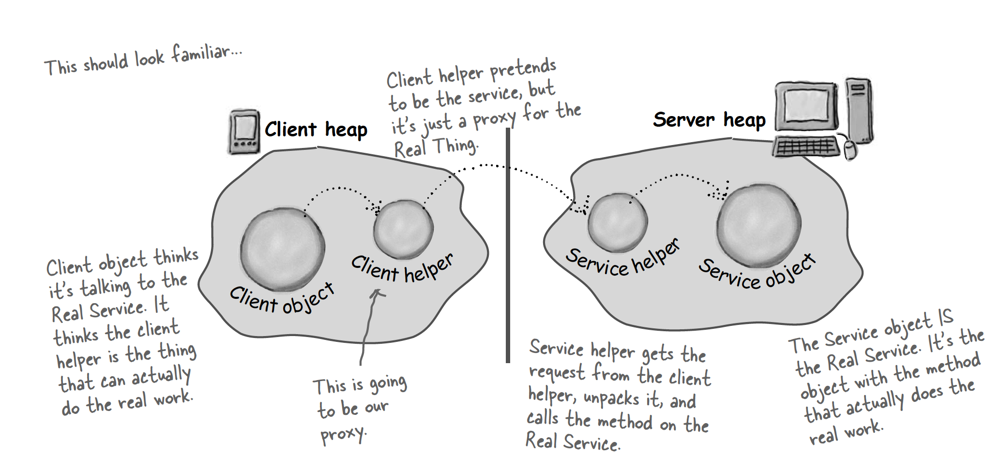
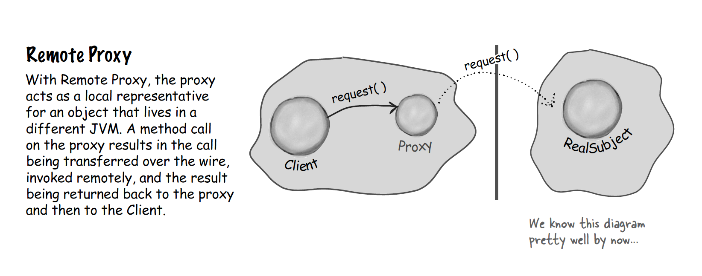

# Virtual Proxy

## Motivation
Let’s say you want to displays a image retrive from a website. If you’re using Swing, you might create an Icon and ask it to load the image from the network. The only problem is, depending on the network load and the bandwidth of your connection, retrieving a CD cover might take a little time, so your application should display something while you are waiting for the image to load. We also don’t want to hang up the entire application while it’s waiting on the image. Once the image is loaded, the
message should go away and you should see the image.

## Goal
controls access to a resource that is expensive to create, create it only when necessary


## Solution
### image proxy, do all the dirty work before the actual picture is fullly loaded
```Java
class ImageProxy implements Icon {

    ImageIcon imageIcon; //real object
    URL imageURL;
    Thread retrievalThread;
    boolean retrieving = false;
    public ImageProxy(URL url) { imageURL = url; }

    public int getIconWidth() {
        if (imageIcon != null) {
            return imageIcon.getIconWidth();
        } else {
            return 800; //still work if the pictu
        }
    }
    public int getIconHeight() {
        if (imageIcon != null) {
            return imageIcon.getIconHeight();
        } else {
            return 600;
        }
    }
    public void paintIcon(fi nal Component c, Graphics g, int x, int y) {
        if (imageIcon != null) {
            imageIcon.paintIcon(c, g, x, y);
        } else {
            g.drawString(“Loading CD cover, please wait...”, x+300, y+190);
            if (!retrieving) {
                retrieving = true;
                retrievalThread = new Thread(new Runnable() {
                    public void run() {
                        try {
                        imageIcon = new ImageIcon(imageURL, “CD Cover”);
                        c.repaint();
                        } catch (Exception e) {
                            e.printStackTrace();
                        }`
                    }
                });
                retrievalThread.start();
            }
        }
    }
}
 
public class ImageProxyTestDrive {

    ImageComponent imageComponent;

    public static void main (String[] args) throws Exception {
        ImageProxyTestDrive testDrive = new ImageProxyTestDrive();
    }
    
    public ImageProxyTestDrive(String initialURL) throws Exception{
        Icon icon = new ImageProxy(initialURL);
        imageComponent = new ImageComponent(icon);
        frame.getContentPane().add(imageComponent);
    }

}
```

# Remote Proxy
## Motivation
You want to invoke functions of an object live in another JVM


## Goal
controls access to a remote object. Create a remote proxy in client, client uses this proxy as if it's the same object in a remote server, but under the hood, the proxy forwards requests from client to server and invoke functions in the real object and return result to client via network


## Solution
Java RMI(remote method invocation), see codes under the folder: Remote-Proxy

# Protection Proxy
## Motivation
In a matchmaking application, only the owner of the account can change his interest while only others can rate him. We need to provide some access control for this application

## Goal
controls access to a resource based on access rights.

## Solution
### Owner Invocation Handler
```Java
import java.lang.reflect.*;
public class OwnerInvocationHandler implements InvocationHandler {
    PersonBean person;
    public OwnerInvocationHandler(PersonBean person) {
        this.person = person;
    }
    public Object invoke(Object pro xy, Method method, Object[] args)  throws IllegalAccessException {
        try {
            if (method.getName().startsWith(“get”)) {
                return method.invoke(person, args);
            } else if (method.getName().equals(“setHotOrNotRating”)) {
                throw new IllegalAccessException();
            } else if (method.getName().startsWith(“set”)) {
                return method.invoke(person, args);
            }
        } catch (InvocationTargetException e) {
            e.printStackTrace();
        }
        return null;
    }
}
```
### non-owner invocation handler
```Java
import java.lang.reflect.*;
public class NonOwnerInvocationHandler implements InvocationHandler {
    PersonBean person;
    public NonOwnerInvocationHandler(PersonBean person) {
        this.person = person;
    }
    public Object invoke(Object proxy, Method method, Object[] args)
    throws IllegalAccessException {
    try {
        if (method.getName().startsWith(“get”)) {
            return method.invoke(person, args);
        } else if (method.getName().equals(“setHotOrNotRating”)) {
            return method.invoke(person, args);
        } else if (method.getName().startsWith(“set”)) {
            throw new IllegalAccessException();
        }
    } catch (InvocationTargetException e) {
        e.printStackTrace();
    }
    return null;
    }
}
```
### Client
```Java
public class MatchMakingTestDrive {
    // instance variables here
    public static void main(String[] args) {
        MatchMakingTestDrive test = new MatchMakingTestDrive();
        test.drive();
    }
    public MatchMakingTestDrive() {
        initializeDatabase();
    }
    public void drive() {
        PersonBean joe = getPersonFromDatabase("Joe Javabean");
        PersonBean ownerProxy = getOwnerProxy(joe);
        ownerProxy.setInterests(“bowling, Go”);
        try {
            ownerProxy.setHotOrNotRating(10);
        } catch (Exception e) {
            System.out.println(“Can’t set rating from owner proxy”);
        }
    }

    PersonBean getOwnerProxy(PersonBean person) {
        return (PersonBean) Proxy.newProxyInstance(
        person.getClass().getClassLoader(),
        person.getClass().getInterfaces(),
        new OwnerInvocationHandler(person));
    }
}
```
