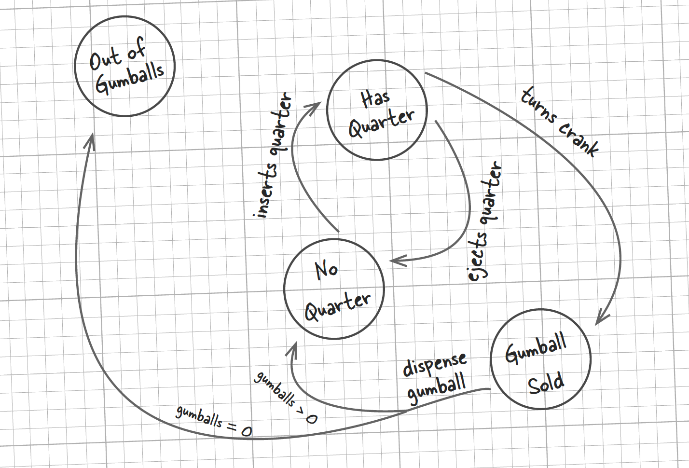

# State Pattern

## Motivation
A gumball machine is commonly seen in the shopping mall. To get a gumball, you inset a quarter, turns the crank and your gumball will drop off the container. The gumball machine has several states and it behavors changes according its current state. For example, you can get your gumball after turning the crank only if you are in the HasQuaterState.


## Goal
Allow gumball machine to alter its behavior when its internal state changes.

## Solution
### State interface
```Java
public abstract class State {
    public void insertQuarter(GumballMachine gumballMachine){};
    public void ejectQuarter(GumballMachine gumballMachine){};
    public void turnCrank(GumballMachine gumballMachine){};
    public void dispense(GumballMachine gumballMachine){};
    public void refill(GumballMachine gumballMachine){};
}
```
### Gumball Machine
```Java
public class GumballMachine {
    private State state;
    private int count;

    public GumballMachine(int count){
        this.count = count;
    }

    public void insertQuarter() {
        state.insertQuarter(this);
    }

    public void ejectQuarter() {
        state.ejectQuarter(this);
    }

    public void turnCrank() {
        state.turnCrank(this);
        state.dispense(this);
    }

    public void refill(int count){
        this.count += count;
        state.refill(this);
    }

    //use protect to constrain that only State can call this method
    protected void setState(State state) {
        this.state = state;
    }

    protected void dispense() {
        if (count != 0) {
            count = count - 1;
        }
    }

    public int getCount(){
        return count;
    }
}
```
### Concrete State is implemented as a singleton
```Java
public class HasQuaterState extends State {
    private static State hasQuaterState = new HasQuaterState();

    private HasQuaterState(){};

    public void ejectQuarter(GumballMachine gumballMachine){
        gumballMachine.setState(NoQuaterState.getInstance());
    };

    public void turnCrank(GumballMachine gumballMachine){
        gumballMachine.setState(SoldState.getInstance());
    };

    public static State getInstance(){
        return hasQuaterState;
    };
}
```
## Definition
The State Pattern allows an object to alter its behavior when its internal state changes. The object will appear to change its class.

## Note
Sample codes have several problems:
- accessability of setState() and dispose(), we don't want client to access these two functions. 
- implementation of singleton is not the best practise